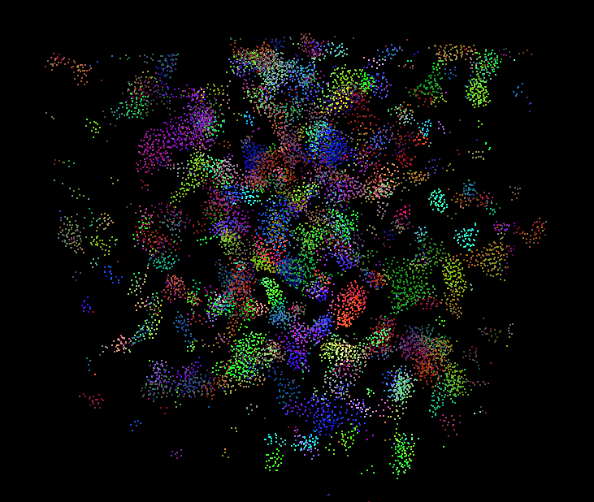
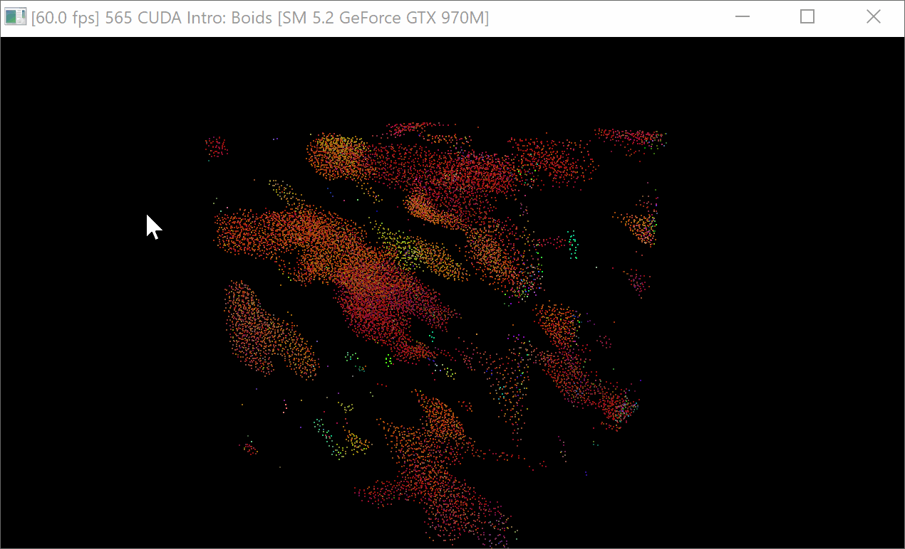
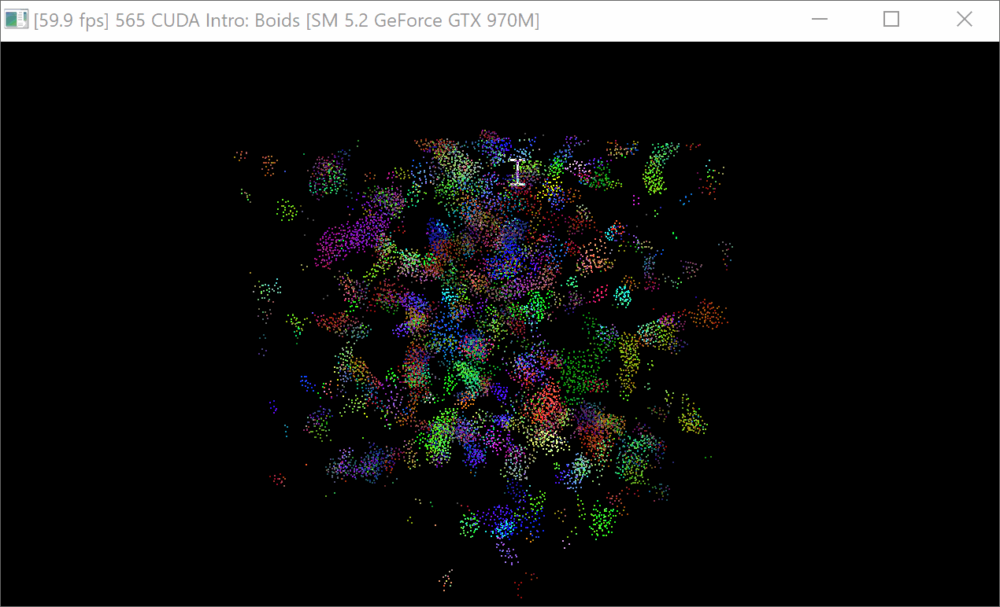
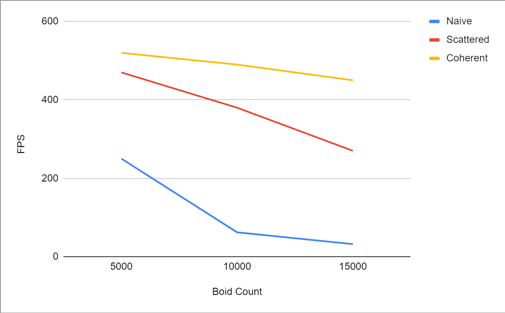
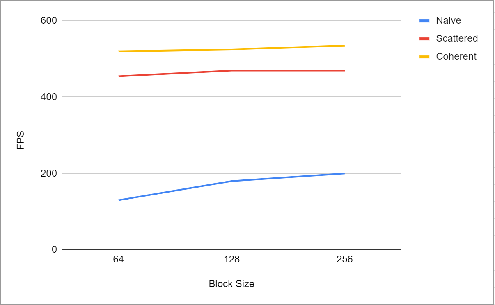

**University of Pennsylvania, CIS 565: GPU Programming and Architecture,
Project 1 - Flocking**

* Joshua Nadel
  * https://www.linkedin.com/in/joshua-nadel-379382136/, http://www.joshnadel.com/
* Tested on: Windows 10, i7-6700HQ @ 2.60GHz 16GB, GTX 970M (Personal laptop)

###

## Part 3: Performance Analysis

I will be using the non-visualization framerate as a benchmark to measure my implementation's performance.

* For each implementation, how does changing the number of boids affect performance? Why do you think this is?

For the naive implementation, increasing the number of boids tremendously slows down performance. This is surely because every boid checks every other boid to determine its neighbors, and so adding more boids exponentially slows down execution. The scattered grid implementation can withstand larger increases in boid count, operating between 50 and 60 fps even at 100,000 boids. The grid-based neighbor check allows the program to skip many boid to boid compares by checking boids against grid cells, of which there are (typically) much fewer. Finally, the coherent grid implementation is able to withstand even more boids. It operates at a consistent 121 fps at 100,000 boids, and can take up to 150,000 before dipping below 60 fps. From my understanding of lower-level memory access optimization, retrieving data from consecutive spaces in memory is much more conducive to the CPU's caching system, through which data can be pre-fetched from memory.

* For each implementation, how does changing the block count and block size affect performance? Why do you think this is?

For the naive implementation, increasing the block size improved the performance; at 5000 boids, the simulation went from 130 to 180 to 200 fps at block sizes of 64, 128, and 256 respectively. For the scattered grid implementation, increasing the block size only slightly improved the performance; at 5000 boids, the simulation went from around 450-460 to 460-480 to 460-480 fps at block sizes of 64, 128, and 256 respectively. For the coherent grid implementation, increasing the block size only slightly improved the performance; at 5000 boids, the simulation went from around 520 to 520-530 to 520-550 fps at block sizes of 64, 128, and 256 respectively. These improvements in performance are likely due to the increase in number of available threads that comes with larger block sizes.

I found no reference to a block count parameter in this project.

* For the coherent uniform grid: did you experience any performance improvements with the more coherent uniform grid? Was this the outcome you expected? Why or why not?

I experienced improvements in performance with the coherent grid. However, I did not expect to. My understanding of program execution time was that the number of accesses or memory reads determines efficiency, and that the specific locations in memory were irrelevant. My understanding is still rudimentary, but I'm beginning to see that by cohering memory together in access order, the computer is able to make certain optimizations through low-level caching.

* Did changing cell width and checking 27 vs 8 neighboring cells affect performance? Why or why not? Be careful: it is insufficient (and possibly incorrect) to say that 27-cell is slower simply because there are more cells to check!

Changing the cell width did not affect performance. While it is the case that the 27-cell check requires more cell checks, it is also the case that the higher-resolution grid allows more cells to be eliminated by the distance check and can eliminate some potential false boid neighbor checks that the 8-cell check wouldn't catch.

## Part 4: Write-up

Boid Count effect on FPS

Block Size effect on FPS
